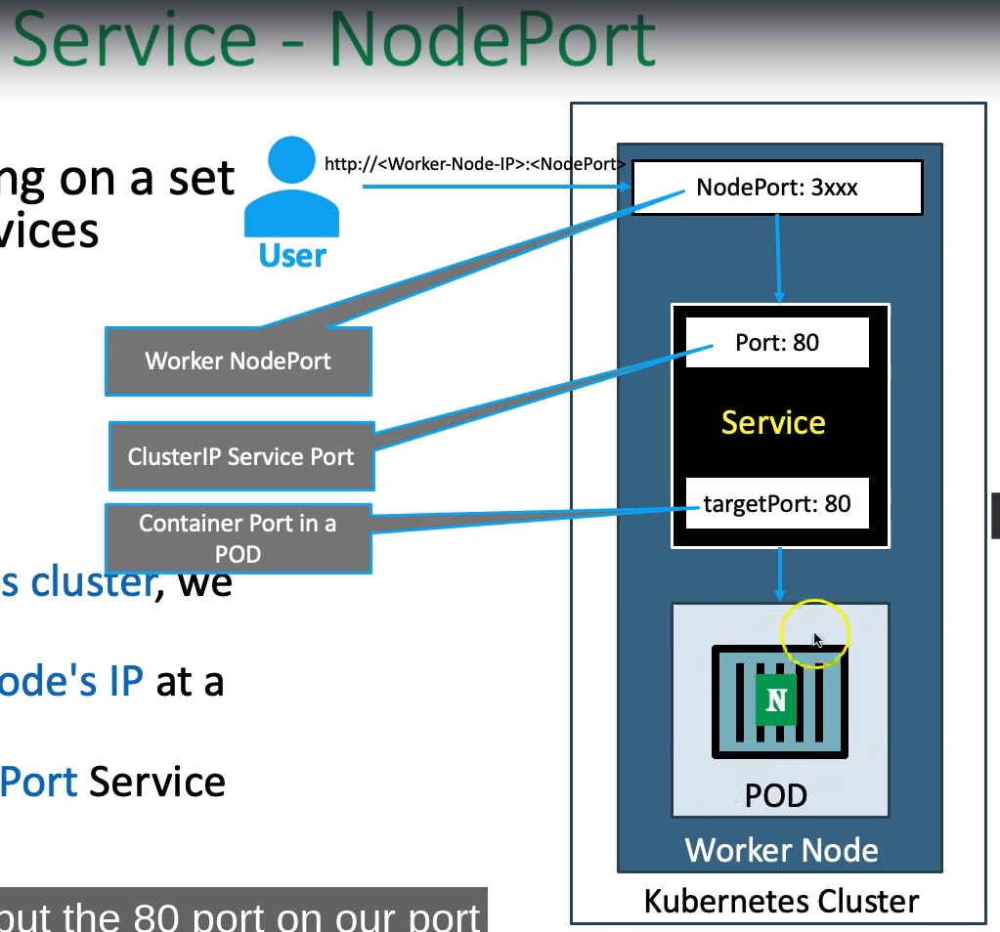

# Kubernetes Basic Concepts

### Create a POD
kubectl run <pod_name> --image <image_name>:<tag>

## Kubernetes Services
We can expose an application running on a set of PODs using different types of Services like:
- ClusterIP
- NodePort
- LoadBalancer

### NodePort Service:
To access our application outside of k8s cluster, we can use NodePort service. Expose the Service on each Worker Node's IP at a static port.
A ClusterIP service, to which the NodePort Service routes, is automatically created.
Port Range 30000-32767

##### Expose with a NodePort
$ kubectl expose pod <running_pod> --type=NodePort --port=<port_to_expose> --name=<service_name>

